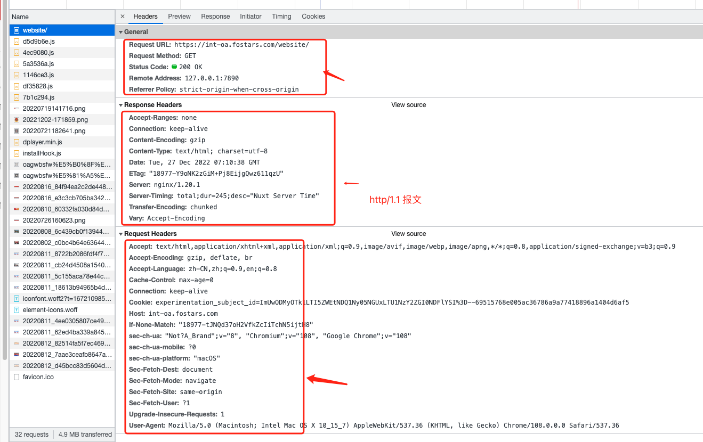

# http1.0 和 http2.0 的区别

## http的特点和缺点

**http特点**

- 灵活可扩展

只规定了基本的格式，比如空格分隔单词，换行分隔字段，其他的各个部分都没有严格的语法限制。另一个是传输形式的多样性，不仅仅可以传输文本，还能传输图片、视频等任意数据，非常方便。

- 可靠传输

HTTP 基于 TCP/IP，因此把这一特性继承了下来。

- 请求-应答

也就是一发一收、有来有回， 当然这个请求方和应答方不单单指客户端和服务器之间，如果某台服务器作为代理来连接后端的服务端，那么这台服务器也会扮演请求方的角色。

- 无状态

这里的状态是指通信过程的上下文信息，而每次 http 请求都是独立、无关的，默认不需要保留状态信息。

**http 缺点**

- 无状态

在需要长连接的场景中，需要大量的上下文信息，以免传输大量重复的信息，那么`无状态`就是缺点

在一些应用中只是位了获取信息，不需要保存连接上下文信息，无状态反而减少了网络开销，那么 `无状态` 就是优点

- 明文传输

协议里的报文（主要是指头部）不使用二进制数据，而使用文本

对调试提供了便利，但是让http的报文信息暴露了，给攻击者提供了便利， `wifi陷阱` 就是利用http明文传输的确定，诱导你连接热点，抓取你所有的流量，拿到你的敏感信息

- 队头阻塞问题

当http开启长连接时，共用一个tcp连接，同一时刻只能处理一个请求，那么当前请求耗时过长的情况下，其他的请求只能处于阻塞状态，也就是著名的队头阻塞问题

**http的长连接**

HTTP长连接是指在HTTP协议中，客户端和服务端建立的一种持久连接。这种连接不会因为请求和响应完成就断开，而是可以保持一段时间，让客户端和服务端能够双向传输数据。要开启HTTP长连接，需要在请求报文中添加“Connection: keep-alive”字段，服务端响应报文中也要添加“Connection: keep-alive”字段，以表示服务端也支持长连接。

### 如何解决http的队头阻塞问题

并发连接

> 一般浏览器可以分配多个长连接，相当于增加了任务队列，每个浏览器的标准不一样，ie是4个，cherome是6个

域名分片

>在http1.1 中浏览器会限制每个域的连接请求数量，为了突破限制，可以将内容分发到多个域名；可以并发更多的请求;由于http2没有并发限制，所以也就不需要用域名分片限制了

可以采取以下措施来解决http的队头阻塞问题：

1. 使用多层缓存技术来减少http请求数量；
2. 使用CDN技术来缩短http响应时间；
3. 使用异步请求技术来解决队头阻塞问题；
4. 使用HTTP/2协议来改善http队头阻塞问题。

## http/2 有哪些改进

由于https在安全方面已经做的很好了，http2改进的关注点放在了性能方面，对于 http/2 来说，他的性能提升主要有两点：

1. 头部压缩
2. 多路复用
3. 设置请求优先级
4. 服务器推送

头部压缩

先看下 http/1.1 的截图

在 http/2 中会使用压缩算法，对请求头进行压缩

多路复用

所有的请求的都是通过一个 TCP 连接并发完成；在多路复用中是基于二进制数据帧的传输、消息、流，所以可以做到乱序的传输。