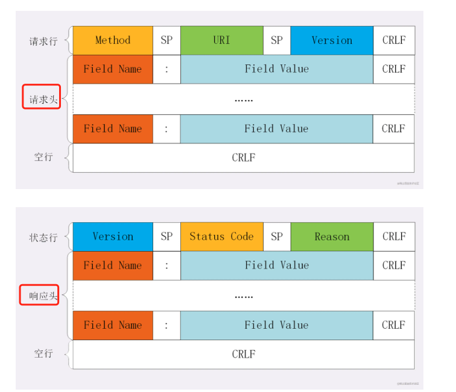
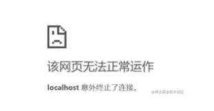

# 精读http

## 什么是http

> 超文本传输协议 (HTTP) [Hyper Text Transfer Protocol]，它是从WEB服务器传输超文本标记语言(HTML)到本地浏览器的传送协议。

## http报文

总体结构

起始行 + 头部 + 空行 + 实体


### 起始行

请求报文

由请求方法 路径 http版本组成

```
GET /home HTTP/1.1
```

响应报文

由http版本 状态码 原因组成

```
HTTP/1.1 200 OK
```

### 头部



1. 字段名不分大小写
2. 字段名不允许出现空格，不可以出现下滑线_
3. 字段名后面紧跟着 `:`

### 空行

用来区分头部和实体

### 实体

具体的数据 就是body部分，请求报文部分对应请求体，相应报文对应响应体

## 如何理解http的请求方法


常见的http请求方法

1. GET：获取资源
2. POST： 提交数据，新增资源
3. DELETE： 删除数据
4. PUT： 修改数据
5. HEAD： 获取资源的元数据


GET 和 POST 的区别

1. 从缓存角度考虑，GET请求会被浏览器主动缓存下来，留下历史记录，POST不会
2. 从TCP角度，GET请求会吧请求报文一次发出去，POST会分为两个TCP数据包，首先发head部分，如果服务器响应100，然后发body部分
3. 从参数考虑，GET一般放在URL中，因此不安全，post放在请求体中，更适合传输敏感数据

### 状态码

1. 1xx 标识目前协议处理的中间状态，还需要后续操作
2. 2xx 表示成功状态
3. 3xx 重定向状态，资源位置发生变动，需要重新请求
4. 4xx 请求报文有误
5. 5xx 服务器端发生错误

2xx

200 OK 通常在响应体中放有数据
201 表示后台新增数据成功
204 no content 也是成功状态，但是响应后没有body数据


3xx

301 永久重定向
302 临时重定向
304 当协商缓存命中时


4xx

400 请求体报错
403 服务器禁止访问
404 资源未找到
405 请求方法不被允许

5xx

500 服务器端报错
501 表示客户端请求的功能还不支持
502 nginx代理的后端服务挂了
503 服务器当前忙

## http特点

1. 灵活可扩展 只规定了报文的格式要求，没有严格的限制，可以传输各种数据
2. 可靠传输，http基于TCP/IP
3. 请求-应答；一发一收，有来有回，
4. 无状态

## HTTP 缺点

1. 无状态
   1. 分情况，单纯获取一些数据，是优点
   2. 长连接，需要保存大量的上下文信息，是缺点
2. 明文传输

  协议的报文使用文本形式，而不是二进制数据，便利了调试，但是吧http的报文信息暴露了，给攻击者提供了便利

3. 队头阻塞问题

当http开启长连接的时候，共用一个TCP连接，同一时刻只能处理一个请求，那么当请求好事过长的情况下，其他的请求将处于阻塞状态，也就是著名的队头阻塞问题


## Accept

数据格式

一般通过mime来确定数据格式，在字段 `Content-Type`上体现

常见的MIME类型

- text text/html text/plain text/css
- image image/gif image/jpeg image/png
- audio/video audio/mpeg video/mp4
- applacation application/json application/javascript application/pdf

压缩方式

采取什么样的压缩体现在 `Content-Encoding` 上，

常用的是gzip

```js
// 发送端
Content-Encoding: gzip
// 接收端
Accept-Encoding: gzip
```

支持语言

```js
// 发送端
Content-Laguage: zh-CN,zh,en
// 接收端
Accept-Laguage: zh-CN,zh,en
```

字符集

```js
Content-Type: text/html;charset=utf-8
Accept-Charset: charset=utf-8
```

## 定长和不定长的数据，http是怎么传输的

nodejs模拟

```js
const http = require('http');

const server = http.createServer();

server.on('request', (req, res) => {
  if(req.url === '/') {
    res.setHeader('Content-Type', 'text/plain');
    res.setHeader('Content-Length', 10);
    res.write("helloworld");
  }
})

server.listen(8081, () => {
  console.log("成功启动");
})
```

浏览器会显示

```
helloworld
```

如果将长度设置小一些

```js
res.setHeader('Content-Length', 8)
```

浏览器中内容会显示如下

```
hellowor
```

实际上在http的响应体中截去了部分内容

如果设置大一些


```js
res.setHeader('Content-Length', 11)
```

浏览器会报错




### 不定长包体

对于不定长包体，就需要使用

```
Transfer-Encoding: chunked
```

```js
const http = require('http');

const server = http.createServer();

server.on('request', (req, res) => {
  if(req.url === '/') {
    res.setHeader('Content-Type', 'text/html; charset=utf8');
    res.setHeader('Content-Length', 10);
    res.setHeader('Transfer-Encoding', 'chunked');
    res.write("<p>来啦</p>");
    setTimeout(() => {
      res.write("第一次传输<br/>");
    }, 1000);
    setTimeout(() => {
      res.write("第二次传输");
      res.end()
    }, 2000);
  }
})

server.listen(8009, () => {
  console.log("成功启动");
})
```

访问效果如下


## Cookie

// 请求头
Cookie: a=xxx;b=xxx
// 响应头
Set-Cookie: a=xxx
set-Cookie: b=xxx

### Cookie 属性

**cookie 有效期**

- Expires 过期时间
- Max-Age 用的是一段时间间隔，单位是s，从浏览器收到报文开始

**作用域**

- Domain 域名
- path 路径

在发送请求之前，发现域名或者路径不匹配，就不会带上cookie，`/` 表示域名下的任意路径都允许使用Cookie

**安全**

- Httponly 只能通过http协议传输，不能通过js访问，也是预防xss的重要手段
- Samesite Strict 模式完全禁止第三方请求携带cookie
- Secure 只能通过https传输cookie

**缺点**

1. 容量缺陷，体积上限只有4kb；只能存储少量信息
2. 性能缺陷；不管域名下的某一路径需不需要cookie，都会携带上cookie，如果请求过多，会带来浪费，可以通过domain和path指定作用域解决
3. 安全缺陷；cookie是用纯文本的形式存储的，如果被截获，是相当危险的；


## 什么是跨域

浏览器遵循同源策略 `schema` `host` `port` 都相同为同源，非同源站点有限制

1. 不能读取和修改对方的dom
2. 不能访问对方的cookie indexDB localStorage
3. 限制XMLHttpRequest请求

当浏览器发送Ajax请求时，只要当前url跟目标url不同源，就会产生跨域

## 浏览器如何拦截响应

跨域请求的响应会被浏览器拦截，响应其实已经成功到达客户端了

浏览器渲染进程将`请求`发送给浏览器主进程，主进程接收到后，发送`网络请求`
服务端处理完请求后，返回响应，主进程检查到跨域，并没有cors，将响应体全部丢掉，并不会发送给渲染进程，就达到了拦截数据的目的

## 如何解决跨域

### cors

cors 是跨域资源共享，服务器需要附加特定的响应头

**简单请求**

请求方法

- GET
- POST
- HEAD

请求头

- ACCEPT
- ACCEPT-Language
- Content-Language
- Content-Type
  - application/x-www-form-urlencoded
  - multipart/form-data
  - text/plain

1. 发送请求，在请求头中添加 Origin 字段，标识来自哪个源
2. 服务器响应时，添加 `Access-Control-Allow-Origin` 字段，如果Origin不在这个范围，就会将响应拦截

跨域请求，默认不会带cookie，如果需要跨域请求携带cookie、

1. 前端请求携带 `withCredentials` 属性
2. 服务器响应需要返回. `Access-Control-Allow-Credentials` 并设置为true


**非简单请求**

除了简单请求就是非简单请求

- PUT 方法
- DELETE 方法

预检请求

```
OPTIONS / HTTP/1.1
Origin: 当前地址
Host: xxx.com
Access-Control-Request-Method: PUT
Access-Control-Request-Headers: X-Custom-Header
```

预检请求的响应


```
HTTP/1.1 200 OK
Access-Control-Allow-Origin: *
Access-Control-Allow-Methods: GET, POST, PUT
Access-Control-Allow-Headers: X-Custom-Header
Access-Control-Allow-Credentials: true
Access-Control-Max-Age: 1728000 // 预检请求的有效期，在此期间，不用发出另外一条预检请求
Content-Type: text/html; charset=utf-8
Content-Encoding: gzip
Content-Length: 0
```

预检请求发出后，如果不满足响应头条件，就会触发XMLHttpRequest的onerror方法，浏览器不会发出cors请求

cors响应

## JSONP

```js
// 客户端请求
const jsonp = ({url, params, callbackName}) => {
  const generateUrl = () => {
    let dataStr = ''
    for(let key in params){
      dataStr += `${key}=${params[key]}&`
    }
    dataStr+=`callback=${callbackName}`
    return `${url}?${dataStr}`
  }
  return new Promise((resolve, reject) => {
    let scriptEl = document.creaateElement('script')
    scriptEl.src = generateUrl()
    document.body.appendChild(scriptEl)
    const cbName = callbackName || 'callback'
    window[cbName] = (data) => {
      resolve(data)
      document.body.removeChild(scriptEl)
    }
  })
}

```

服务端响应

```js
let express = require('express')

let app = express()
app.get('/', function(req, res) {
  let {a, b, callback} = req.query
  // get data
  const data = {name: 'data'}
  res.end(`${callback}(${data})`)
})
```

调用

```js
jsonp({
  url: 'http://locahost:3000',
  params: {
    a: 1, b: 2
  }
}).then(data => {
  console.log(data)
})
```

