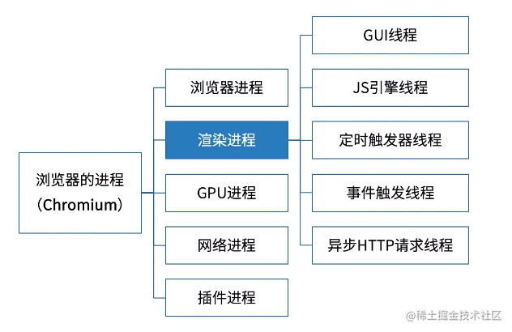
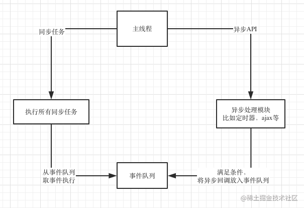
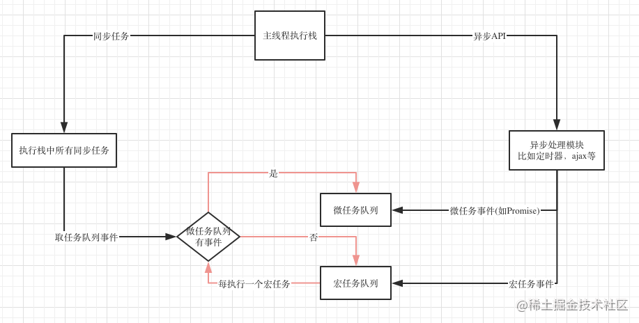

# EventLoop

`EventLoop` 就是事件循环，其实就是js `管理事件` 执行的一个流程;具体的管理办法由他具体的运行环境确定，目前js的主要运行环境有两个, `浏览器`和`NODE.js`;

- setTimeout
- setImmediate
- Promise
- Process.nextTick

## js是如何实现异步的




每个选项卡有自己的渲染进程，所以如果一个tab页面崩溃并不会导致浏览器崩溃

对于前端来说，主要关心的是渲染进程

GUI线程

GUI线程就是渲染页面的，解析html和css，然后构建dom树和渲染树

JS引擎线程

这线程是负责执行js的主线程，常说的 `js是单线程的` 就是这个线程；`这个线程跟GUI线程是互斥的`；因为js也可以操作DOM；如果js线程和GUI线程同时操作DOM；结果就乱了；不知道到底渲染哪个结果；
带来的后果就是如果JS长时间运行；GUI线程不能执行，整个页面就感觉卡死；

定时器线程

`setTimeout` 就是运行在这里，他跟js主线程根本不在一个地方，所以`单线程的js`能够实现异步；js的定时器方法还有 `setInterval`，也是在这个线程

异步HTTP请求线程

这个线程主要负责处理异步的ajax请求；当请求完成后，会通知事件触发线程；然后事件触发线程将这个事件放入事件队列；然后主线程从任务队列中取出事件继续执行


## 浏览器的EventLoop

事件循环就是一个循环，是各个异步线程用来通讯和协同执行的机制；各个线程为了交换信息，还有一个公用的数据区，这就是事件队列；各个异步线程执行完成后，通过事件触发线程将回调事件放到事件队列；主线程每次干完手上的活儿就来看看这个队列还有没有新活；有的话就取出来执行




流程讲解如下

1. 主线程每次执行时，先看看要执行的是同步任务还是异步的api
2. 同步任务就继续执行，一直执行完
3. 遇到异步API就将他交给对应的异步线程；自己继续执行同步任务
4. 异步线程执行异步API；执行完成后，将异步回调事件放到事件队列上
5. 主线程手上的同步任务干完后就来事件队列看看有没有任务
6. 主线程发现事件队列有任务，就取出来执行任务
7. 主线程不断的循环上述流程

## 定时器不准

因为主线程总是先执行同步任务，然后再执行异步任务

1. 执行同步任务
2. 遇到setTimeout
3. 定时器线程开始计时，2s到了通知事件触发线程
4. 事件触发线程将回调放入事件队列，异步流程到此结束
5. 主线程如果有空，将定时器拿出来执行，没有空回调就一直在队列里

```js
const syncFunc = (startTime) => {
  const time = new Date().getTime();
  while(true) {
    if(new Date().getTime() - time > 5000) {
      break;
    }
  }
  const offset = new Date().getTime() - startTime;
  console.log(`syncFunc run, time offset: ${offset}`);
}

// 因为一直被syncFunc阻塞占用线程，导致setTimeout不准
const asyncFunc = (startTime) => {
  setTimeout(() => {
    const offset = new Date().getTime() - startTime;
    console.log(`asyncFunc run, time offset: ${offset}`);
  }, 2000);
}

const startTime = new Date().getTime();

asyncFunc(startTime);

syncFunc(startTime);
```


## 引入微任务

事件队列里面的事件可以分为两类：

- 宏任务
- 微任务

微任务有更高的优先级；当事件循环遍历队列时，先检查任务队列，如果有微任务，就全部拿出来执行，执行完成后再执行一个宏任务，执行每个宏任务之前，都要检查下是否有微任务，如果有，就优先执行微任务




常见的宏任务有：

1. script
2. setTimeout/setInterval
3. setImmediate (Node.js)
4. I/O
5. UI事件
6. postMessage

微任务有

1. Promise
2. process.nextTick(Node.js)
3. Object.observe
4. MutaionObserver


## Nodejs 的 EventLoop


1. timers: 执行setTimeout和setInterval的回调
2. pending callbacks: 执行延迟到下一个循环迭代的 I/O 回调
3. idle, prepare: 仅系统内部使用
4. poll: 检索新的 I/O 事件;执行与 I/O 相关的回调。事实上除了其他几个阶段处理的事情，其他几乎所有的异步都在这个阶段处理。
5. check: setImmediate在这里执行
6. close callbacks: 一些关闭的回调函数，如：socket.on('close', ...)


setImmediate 会比 setTimeout 先执行

```js
console.log('outer');

setTimeout(() => {
  console.log('setTimeout');
}, 0);

setImmediate(() => {
  console.log('setImmediate');
});
```


node.js里面setTimeout(fn, 0)会被强制改为setTimeout(fn, 1),

关键就在这个1毫秒，如果同步代码执行时间较长，进入Event Loop的时候1毫秒已经过了，setTimeout执行，如果1毫秒还没到，就先执行了setImmediate

**process.nextTick**

process.nextTick()是一个特殊的异步API，他不属于任何的Event Loop阶段。事实上Node在遇到这个API时，Event Loop根本就不会继续进行，会马上停下来执行process.nextTick()，这个执行完后才会继续Event Loop。


```js
var fs = require('fs')

fs.readFile(__filename, () => {
    setTimeout(() => {
        console.log('setTimeout');
    }, 0);

    setImmediate(() => {
        console.log('setImmediate');
        process.nextTick(() => {
          console.log('nextTick 2');
        });
    });

    process.nextTick(() => {
      console.log('nextTick 1');
    });
});
// nextTick 1
// setImmediate
// nextTick2
// setTimeout
```

process.nextTick 比 promise优先级更高

```js
const promise = Promise.resolve()
setImmediate(() => {
  console.log('setImmediate');
});
promise.then(()=>{
    console.log('promise')
})
process.nextTick(()=>{
    console.log('nextTick')
})
// nextTick
// promise
// setImmediate
```

## 总结

本文从异步基本概念出发一直讲到了浏览器和Node.js的Event Loop，现在我们再来总结一下：

1. JS所谓的“单线程”只是指主线程只有一个，并不是整个运行环境都是单线程
2. JS的异步靠底层的多线程实现
3. 不同的异步API对应不同的实现线程
4. 异步线程与主线程通讯靠的是Event Loop
5. 异步线程完成任务后将其放入任务队列
6. 主线程不断轮询任务队列，拿出任务执行
7. 任务队列有宏任务队列和微任务队列的区别
8. 微任务队列的优先级更高，所有微任务处理完后才会处理宏任务
9. Promise是微任务
10. Node.js的Event Loop跟浏览器的Event Loop不一样，他是分阶段的
11. setImmediate和setTimeout(fn, 0)哪个回调先执行，需要看他们本身在哪个阶段注册的，如果在定时器回调或者I/O回调里面，setImmediate肯定先执行。如果在最外层或者setImmediate回调里面，哪个先执行取决于当时机器状况。
12. process.nextTick不在Event Loop的任何阶段，他是一个特殊API，他会立即执行，然后才会继续执行Event Loop
