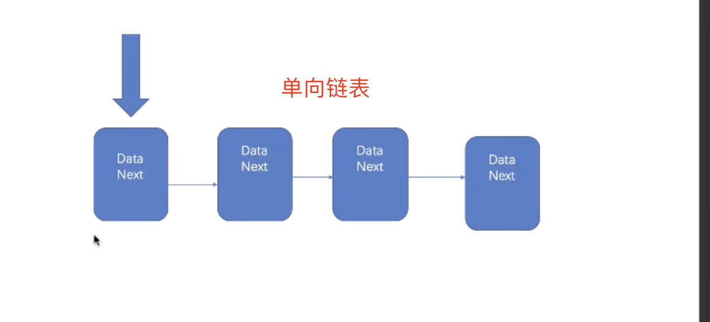
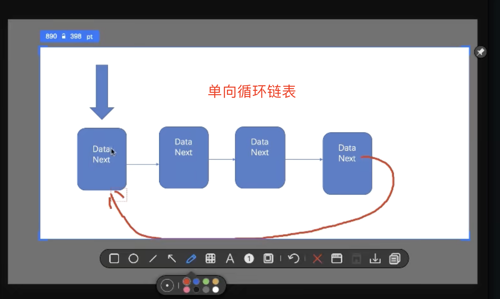
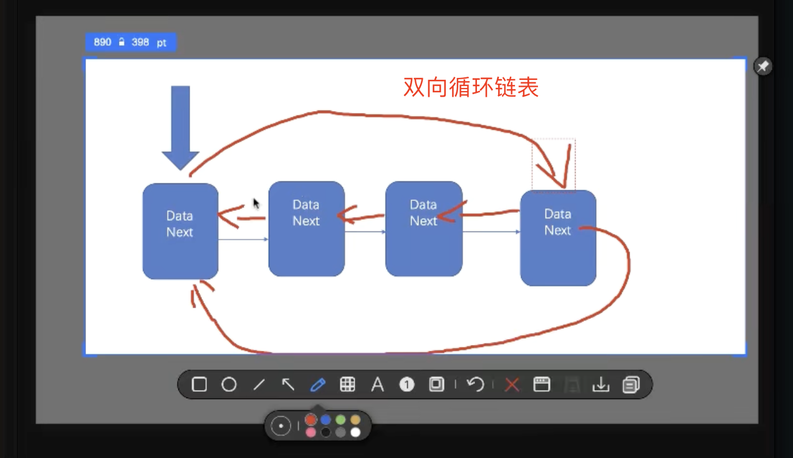
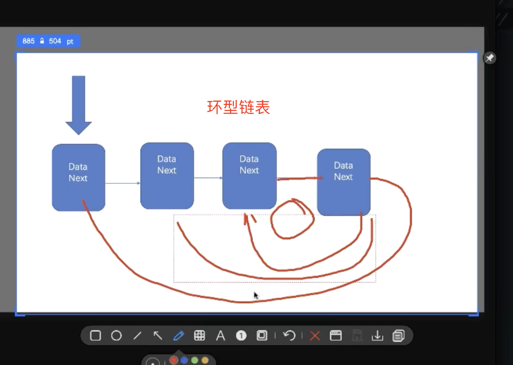

## js如何实现链表

数组

> 存储连续空间的值


单向链表

> 单向有头有尾，线性的数据结构，可以存储不连续空间的值



```js
// 单向链表实现
export class Node {
  constructor(element){
    this.element = element
    this.next = null
  }
}

// 链表
export class LinkedList {
  constructor(){
    this.size = 0
    this.head = null
  }
  append(element){
    let node = new Node(element)
    if(this.head === null){
      this.head = node
    } else {
      let current = this.getNode(this.size -1)
      current.next = node;
    }
    this.size++
  }
  appendAt(position, element){
    if(position < 0 || position > this.size){
      throw new Error('position out range')
    }
    let node = new Node(element)
    if(position === 0){
      node.next = this.head
      this.head = node
    } else {
      let pre = this.getNode(position - 1)
      node.next = pre.next
      pre.next = node
    }
    this.size++
  }
  removeAt(position){
    if(position < 0 || position >= this.size){
      throw new Error('position out range')
    }
    let current = this.head
    if(position === 0){
      this.head = current.next
    } else {
      let pre = this.getNode(position - 1)
      current = pre.next
      pre.next = current.next
    }
    this.size--
  }
  // 查找指定元素的索引
  indexOf(element){
    let current = this.head
    for(var i=0;i < this.size; i++){
      if(current.element === element){
        return i
      }
      current = current.next
    }
    return -1
  }
  getNode(index){
    if(index < 0 || index >= this.size){
      throw new Error('out range')
    }
    let current = this.head
    for(var i=0; i< index; i++) {
      current = current.next
    }
    return current
  }
}

let ll = new LinkedList()

ll.append(1)
ll.append(2)
ll.appendAt(2,3)
ll.appendAt(3,4)
// ll.removeAt(1)
// ll.removeAt(0)
console.log(ll.indexOf(1))
console.log(ll)
```

双向链表


单向循环链表



双向循环链表



环型链表

